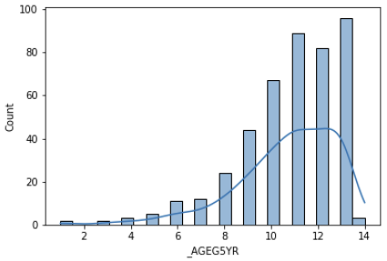

# DS-5100 Group Project

Uyen Nguyen (gmd8sq) \
Andy Ortiz (eao7r) \
Lee Ann Johnson (lj6gd) \
JD Pinto (jp5ph)

## Introduction 
Our group plans to utilize data from the 2020 BRFSS Annual Survey Data.  We propose to construct a logistic regression. Demographic data,  such as income, education, ethnicity, and geographic location, will be used to predict cancer survivorship outcomes, such as receiving a survivorship care plan.

## The Data 
“The Behavioral Risk Factor Surveillance System (BRFSS) is the nation’s premier system of health-related telephone surveys that collect state data about U.S. residents regarding their health-related risk behaviors, chronic health conditions, and use of preventive services. Established in 1984 with 15 states, BRFSS now collects data in all 50 states as well as the District of Columbia and three U.S. territories. BRFSS completes more than 400,000 adult interviews each year, making it the largest continuously conducted health survey system in the world.” - Source: [CDC BRFSS](https://www.cdc.gov/brfss/index.html)

Since this is a rather big dataset, we decided to filter out survery data that only has lung cancer. We initially did this for 2020, but we went back and added several other years to yield a larger sample dataset in order to train our logistic regression. But inital data exploratory from the dataset of only 2020 painted the picture:

  

Which confirmed our assumption of lung cancer being prevalent in the middle age to older adult population. The histogram showed a left skewed distribution, capturing the more older adults with lung cancer as opposed to younger adults being interviewed from the survey. 

We also wanted to visualize states that conducted topics on lung cancer so we produced the plot:

  

This plot can be interacted via the lung cancer sandbox script in our Scripts folder. The plot displays the value and the abbreviation of the state when hovered on (available in the lung cancer sandbox ipynb) 

Furthermore, we came up with an initial logistic regression of the variable CSRVSUM with respect to sex, age groups, education levels, and marital status, which gave us:

  

As well as a confusion matrix and score:

  

We have more visuals and results on the way as our group wraps up on final details and interpretation. We are excited to share our findings with all of you soon!

## Experimental Design 
For this project, we propose to fit a MLRM onto the selected data set to predict both cancer survivorship outcomes for 2020 and in subsequent years when the survivorship question module is administered. The following steps briefly outline the proposed project methodology:

- [x] Download the dataset LLCP2020.xpt from CDC
- [x] Create a colab notebook 
- [x] Import the necessary packages (google.colab, pandas, etc.)
- [x] Explore and clean the dataset
- [x] Visualize the data
- [x] Develop a hypothesis
- [x] Outline our assumptions
- [ ] Check our assumptions
- [x] Fit the regression model
- [x] Interpret the results 
- [ ] Write code for user interaction with graphs and plots

## Project Management
Roles: Uyen Nguyen (Programmer), Andy Ortiz (Programmer), JD Pinto (Project Manager), Lee Ann Johnson (Data interpretation/Writing/Editing)

- [x] Milestone 1 (Week 1-2): Choose predictor and response variables, develop hypotheses, outline assumptions, check assumptions (if assumptions fail, remedy the assumptions or find alternative approach to analysis).  

- [x] Milestone 2 (Week 3-4): Fit the model, extract insights from graphs, write unit tests, draw conclusions  

- [ ] Milestone 3 (Week 5-6): Debug and test code, organize visualizations

- [ ] Milestone 4 (Week 7-8): Conclude all steps from above and produce a presentation/video. 

## Results
Based on analysis output, including graphs, we will interpret the results and contextualize the findings within the context of cancer survivorship. Meaningful graphs will be created.

## Testing 
For this proposal, to ensure accuracy of the code and robustness of results,  we will use exception testing and unit tests.

## Conclusions 
The goal of this proposal is to:

1. Use our tool to apply the model across different years of data and 
2. Explore health equity in cancer survivorship outcomes. Findings can provide feedback to states about trends in cancer survivorship as well as provide evidence as to the importance of including these questions in future iterations of the BRFSS surveys. 

